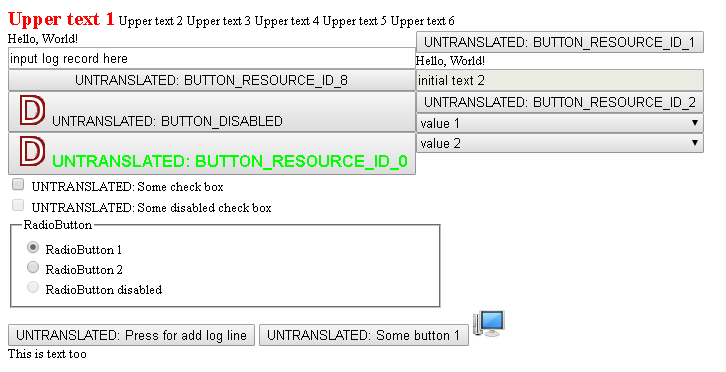

# formoshlep
Vaadin-like dlangui web platform

## Current state
This project is in "proof of concept" state.
Supported only `Button` actions. JavaScript isn't used and isn't need to be enabled in browser.

This picture shows currently supported widgets:

## Usage
Briefly: it is need to add `import formoshlep;` line into your code and fill out HTTP server settings.
Your existing code should work as usual, but see section "Current state" for current disadvantages.

For more information see `example/`.
